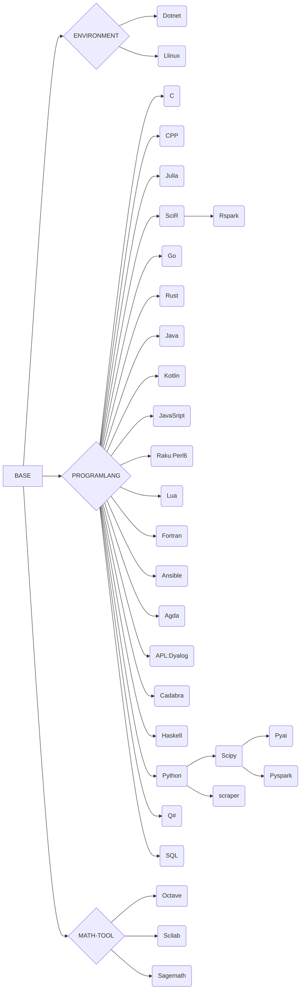

# jupyter-image-stacks
## 如果您通过github访问本项目，请注意
1. github上的仓库是由源仓库推送的镜像仓库，是一个镜像仓库
2. 我们的源仓库是 https://eoelab.org:1031/build-image-stacks/jupyter-image-stacks  
3. 我们的docker镜像仓库是 https://hub.docker.com/r/ben0i0d/jupyter   
4. 对于issue/PR，我们推荐在源仓库上提，这对于我们工作更方便，但是如果您在github上提，我们也会跟进处理  
## 项目梗概
### 用途
用于支撑我们基础计算设施与公开IDE-Jupyterhub的镜像构建项目，测试与工作场景是Rancher管理的基于RKE2的私有K8S集群，并完成汉化，扩展等工作  
### 如何使用

**Docker**

镜像可以像jupyternotebook一样使用，容器端口为8888  
对于用后即抛地使用，可以用如下指令,注意这没有数据持久化，意味着你需要使用诸如Git等工具同步您的工作进度  
`docker run -p 8888:8888 ben0i0d/jupyter:<tag>`  
对于需要长期使用，可以用如下指令，这将挂载一个目录到容器内,以提供数据持久化  
`docker run -it --rm -p 8888:8888 -v "${PWD}":/home/jovyan ben0i0d/jupyter:<tag>`

**Jupyterhub**

在singleuser内的profile指定镜像即可  
例如：
```
    - description: DL environment with GPU
      display_name: DL_GPU environment
      kubespawner_override:
        extra_resource_limits:
          nvidia.com/gpu: '1'
        image: ben0i0d/jupyter:dl-g
```
### 当前构建镜像清单
* Upstream: 镜像上游，类似于jupyter官方的minimal-notebook镜像  
提供软件包：文件压缩/解压(.bz2|.zip|.rar|.7z)，项目管理(git|git lfs),证书管理(ca-certificates)，编辑器（vim）,网络交互（curl|wget）,中文字体（fonts-wqy-zenhei） 
* Llinux（With Desktop-GUI）：在无特权的情况下学习Linux系统，提供Xfce桌面支持   
* Python：支持Python，简洁、易读、多用途的高级编程语言，强调代码可读性和生产力。
* C: 支持C(versions ≥ C89)，通用的编程语言，底层和高效，广泛应用于系统级开发和嵌入式设备。
* CPP：支持CPP（11,14,17），多范式的编程语言，是C语言的扩展，具备面向对象和泛型编程能力，广泛应用于系统级开发和大规模软件项目。
* Cadabra: 支持Cadabra（Cadabra2），一种基于符号计算的软件系统，专门用于进行复杂代数计算和张量分析，适合在理论物理学和相对论研究中使用。
* Julia：支持Julia，高性能、动态的编程语言，设计用于科学计算和数据分析，具备类似Python的易读性和类似C的执行速度。
* SciR：支持R的科学计算环境，面向统计分析和数据可视化的编程语言，拥有丰富的数据处理库和强大的统计功能，广泛应用于数据科学和研究领域。
* Haskell: 支持Haskell，纯函数式编程语言，强调表达力和静态类型检查，提供强大的模式匹配和高阶函数支持，适用于函数式编程爱好者和学术研究。
* Java: 支持Java，面向对象的通用编程语言，跨平台特性和庞大的生态系统，广泛应用于企业级开发、移动应用程序和大型软件项目。
* Kotlin: 支持Kotlin，现代、静态类型的编程语言，与Java互操作性良好，提供更简洁、安全和高效的语法，用于Android开发和跨平台应用程序。
* JavaSript: 支持JavaSript，一种广泛应用于网页开发的脚本语言，用于实现交互性和动态效果，也适用于服务器端开发和移动应用程序。
* Go: 支持Go，简洁、高效的编程语言，注重并发和性能，适用于构建可扩展的网络服务，被广泛应用于云计算、分布式系统和网络编程领域。
* Rust: 支持Rust，安全、并发和高性能的系统级编程语言，强调内存安全和线程安全，适合开发高效且可靠的系统软件，如操作系统、网络服务和嵌入式设备。
* Fortran：支持Fortran，最早的高级编程语言之一，用于科学计算和数值分析，特别擅长处理大规模、复杂的数值计算问题，在科学领域仍广泛使用。
* Ansible: 支持Ansible，开源的自动化工具，用于配置管理、部署和编排任务，在服务器管理和系统自动化方面广泛应用，简化了复杂的IT操作流程。
* Agda: 支持Agda，依赖类型的函数式编程语言和交互式证明工具，强调形式化验证和程序正确性，在形式化方法和类型理论研究中广受欢迎。
* APL (Dyalog): 支持APL (Dyalog)，一种符号化的数组编程语言，极具表达力和紧凑性，适用于高维数据处理、数学建模和算法开发，Dyalog是其中一种流行的实现版本。
* Chapel: 支持Chapel，用于高性能并行编程的并发编程语言，旨在简化分布式计算和大规模数据处理，具备易用性和可移植性，适用于科学计算、并行算法和并行任务调度。
* Raku(Perl 6): 支持Raku(Perl 6)，前身为Perl 6，多范式编程语言，融合了面向对象、函数式和响应式编程概念，强调可读性和灵活性，在文本处理、脚本编写和Web开发方面具备强大的能力
* Lua: 支持Lua，轻量级、嵌入式的脚本语言，具有简洁的语法和快速的执行速度，广泛应用于游戏开发、嵌入式系统和脚本扩展。
* SQL: 支持SQL，是一种用于管理和处理关系型数据库的语言。它是一个标准化的语言，通常用于执行各种操作，例如创建、修改和删除数据库中的表格，以及检索、插入、更新和删除表格中的数据。在环境中提供duckdb数据库
* Scipy：提供Python的科学计算环境，提供了丰富的数值计算、优化、信号处理、统计分析等功能，用于科学研究和工程应用。
* Scraper: 提供Python的网页采取环境，用于提取互联网上的数据，实现自动化的信息收集和分析任务，适用于数据挖掘、网络爬虫以及业务情报收集等应用场景。
* Pyspark: 提供基于Python的Spark编程接口，用于大规模数据处理和分析，提供了强大的并行计算能力和丰富的数据操作函数，适合在分布式环境中进行高效的数据处理和机器学习任务。
* pyai（With GPU）：提供常用AI工具链，集成TF,Torch,Transformer，提供了丰富的深度学习框架和NLP模型库，使开发人员能够轻松构建和训练各种人工智能模型，并应用于图像识别、自然语言处理等领域。
* Rspark: 提供基于R的Spark编程接口，用于在Spark上运行R代码。提供了R语言在大数据处理和分布式环境中的能力，可以进行高效的数据操作、机器学习和统计分析，适用于大规模数据处理和分析任务。
* Sagemath：一个开源的数学计算系统，结合了多个数学软件包，提供了广泛的数学功能，如数值计算、符号计算、离散数学和统计分析。它也是一个交互式计算环境，方便进行数学建模、算法设计和学术研究。  
* Dotnet: 一个跨平台的开发框架，支持C#、F#、PW，用于构建各种类型的应用程序，包括Web应用、桌面应用和移动应用。它提供了丰富的类库和工具，简化了开发过程，并具有高性能和可扩展性。
* Scilab（With Desktop-GUI）: 开源的数值计算软件，适用于科学和工程领域中的数值分析、数据可视化、模拟和建模。它提供了丰富的数学函数和工具箱，支持矩阵计算、符号计算和绘图功能，是一个强大的数学工具，尤其适用于教育和研究领域，提供Xfce桌面支持，包含APT可获取的全部插件。
* Octave: 开源的数值计算软件，类似于Matlab，用于科学计算、数据分析和数值模拟。它提供了强大的矩阵运算、绘图功能以及丰富的数值分析函数，是一个免费且便捷的工具，适合进行数学建模、算法开发和教学任务，包含APT可获取的全部插件。

### 插件清单

**全局**
* jupyterlab-language-pack-zh-CN:对中文的支持
* jupyterlab_tabnine：用于自动补全、参数建议、函数文档查询、跳转定义

**局部**


### 镜像依赖关系


### 如何参与
项目内main分支Dockerfile是经过测试而发布的，如果您有测试或者新需求，请构建一个新分支，注意修改新分支内的CI配置文件，并且在提交合并请求时还原CI配置

## 上游

**软件包版本**
* cuda 12.1.0
* cudnn 8
* Python 3.11
* Julia 1.9.2
* Java zulu17-jdk
* kotlin(jre) openjdk-17-jre
* Dotnet 7.0
* Tensorflow latest
* pytorch latest
* spark 3.4.1
* jupyterlab 4

**镜像源**
* conda bfsu：https://mirrors.bfsu.edu.cn/help/anaconda/
* pip bfsu：https://mirrors.bfsu.edu.cn/help/pypi/
* apt ustc：https://mirrors.ustc.edu.cn/help/ubuntu.html
* npm npmmirror(AliYun): https://registry.npmmirror.com/
* apache tuna: https://mirrors.tuna.tsinghua.edu.cn/apache/
* julia-pkg ustc: https://mirrors.ustc.edu.cn/julia/
* hackage ustc: https://mirrors.ustc.edu.cn/hackage/
* Stackage ustc: https://mirrors.ustc.edu.cn/stackage/
* GO AliYun: https://mirrors.aliyun.com/goproxy/
* cargo ustc: git://mirrors.ustc.edu.cn/crates.io-index

### 项目上游
jupyter团队项目 https://github.com/jupyter/docker-stacks

**但是我们与上游差别较大，包括源，软件包，本地化与扩展等，因此如果您从本项目派生遇到问题，请不要到jupyter团队提问，这会加大他们的工作量**

### kernel
* C: https://github.com/XaverKlemenschits/jupyter-c-kernel
* Cpp: https://github.com/jupyter-xeus/xeus-cling
* Python：https://ipython.org/
* Go: https://github.com/gopherdata/gophernotes
* Haskell: https://github.com/gibiansky/IHaskell
* Java: https://github.com/SpencerPark/IJava
* JavaScript: https://github.com/n-riesco/ijavascript
* Julia: https://github.com/JuliaLang/IJulia.jl
* R: http://irkernel.github.io/
* Rust: https://github.com/evcxr/evcxr
* agda: https://github.com/lclem/agda-kernel
* ansible: https://github.com/ansible/ansible-jupyter-kernel
* Octave: https://github.com/Calysto/octave_kernel
* Dotnet(C#,F#,Powershell)： https://github.com/dotnet/interactive
* Kotlin: https://github.com/Kotlin/kotlin-jupyter
* Fortran: https://github.com/lfortran/lfortran
* APL (Dyalog): https://github.com/Dyalog/dyalog-jupyter-kernel
* Raku(Perl6): https://github.com/bduggan/raku-jupyter-kernel
* Lua: https://github.com/guysv/ilua
* Cadabra: https://github.com/kpeeters/cadabra2
* Chapel: http://github.com/krishnadey30/jupyter_kernel_chapel
* SQL: https://github.com/suyin1203/duckdb_kernel


## 必要的版权说明
对于派生自其他团队的代码，我们在文件头添加了原版版权声明，我们保留并且支持其他开发团队版权

