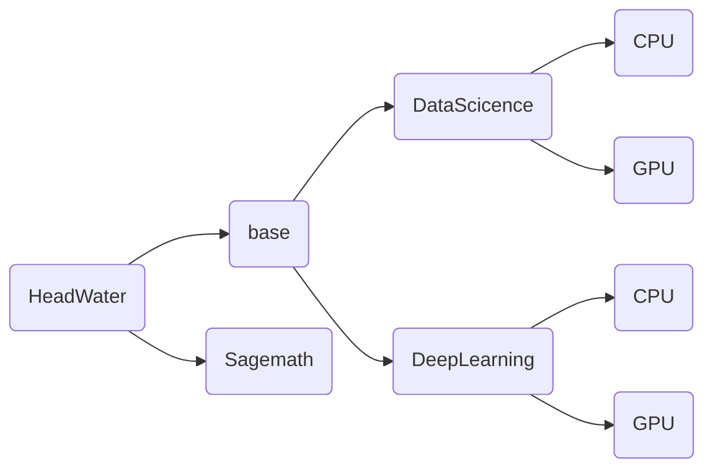

# jupyter-image-stacks

## 我是谁
用于支撑eoelab基础计算设施jupyterhub的镜像制作项目  
使用docker作为运行时平台，镜像可以像jupyternotebook一样使用，容器端口为8888  
更多的构建细节可以查看jupyter团队项目https://github.com/jupyter/docker-stacks  
本项目计划将容器内上游切换为Debian，不过这在客户端透明
## 镜像依赖关系
节点内为镜像，默认子节点是父节点的派生  

## 目前支持清单
1. Python  
这包括Python支持，conda，pip
2. DataScience  
这包括Python与科学计算常用包支持，Julia支持，R与常用包支持  
Julia使用自己的PKG包管理工具，所以使用时注意对PKG换源并且安装包  
3. Sagemath  
这是一个遵循GPL的开源数学工具  
4. DeepLearning  
通常只提供Python语言支持，集成TensorFlow,Pytorch,Transformer,Oneflow支持  
**对于DL与DataScience，提供GPU支持，包括CUDA等**  
## 如何提交意见或参与
如果您有更好的思路，可以在本项目中提出issue  
## 注意
1. 默认情况下，项目内main分支所有Dockerfile是经过测试而发布的，test目录是待测试的镜像，欢迎进入测试
2. 本项目默认落地场景是我们自建的K8S，K8S底层是RKE，也就是docker

