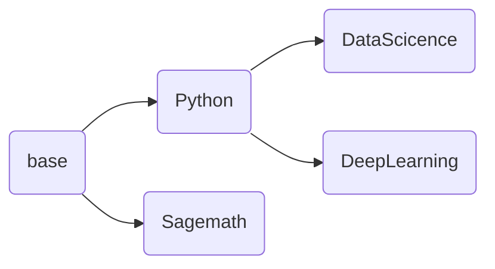

# jupyter-image-stacks

## Who am I?
The image production project supporting jupyterhub,the eoelab basic computing facility.
With docker as the runtime platform, the images can be used like an jupyternotebook with container port 8888.
The construction of more details can be check jupyter team project: https://github.com/jupyter/docker-stacks.
This project plans to switch the headwater of container to Debian, but this is transparent on the client side.
## Mirror dependence
The content of node is an image, and the default child node is a derivative of the parent node.

## Currently supports list
1. Python
This includes Python support, conda, pip.
2. DataScience
This includes Python and Scientific Computing common package support, Julia support, and R with common package support.
Julia uses its own PKG package management tool, so pay attention to change the source of PKG and install the package when using it.
3. Sagemath
This is a GPL-compliant open source math tool.
4. DeepLearning
Usually only provides the Python language support, integrated TensorFlow, Pytorch, Transformer, Oneflow support.
**For DL and DataScience, GPU support, including CUDA, etc**
5. MATLAB
A mathematical tool commonly used in engineering, but requires a user's own license.
**This image may be removed from support in the next version**
## How to submit comments or participate
If you have a better idea, ask the issue in this project.
## Attention
1. By default, all dockerfiles in the main branch of the project are published after testing. The test directory is the image to be tested. Welcome to test.
2. The default application scene of this project is our self-built K8S, and the bottom of K8S is RKE, that is, docker.

## 我是谁
用于支撑eoelab基础计算设施jupyterhub的镜像制作项目  
使用docker作为运行时平台，镜像可以像jupyternotebook一样使用，容器端口为8888  
更多的构建细节可以查看jupyter团队项目https://github.com/jupyter/docker-stacks  
本项目计划将容器内上游切换为Debian，不过这在客户端透明
## 镜像依赖关系
节点内为镜像，默认子节点是父节点的派生  

## 目前支持清单
1. Python  
这包括Python支持，conda，pip
2. DataScience  
这包括Python与科学计算常用包支持，Julia支持，R与常用包支持  
Julia使用自己的PKG包管理工具，所以使用时注意对PKG换源并且安装包  
3. Sagemath  
这是一个遵循GPL的开源数学工具  
4. DeepLearning  
通常只提供Python语言支持，集成TensorFlow,Pytorch,Transformer,Oneflow支持  
**对于DL与DataScience，提供GPU支持，包括CUDA等**  
5. MATLAB  
一个工科常用的数学工具，但是需要用户自己具有许可证  
**这个镜像可能会在下一版本中被移除支持**  
## 如何提交意见或参与
如果您有更好的思路，可以在本项目中提出issue  
## 注意
1. 默认情况下，项目内main分支所有Dockerfile是经过测试而发布的，test目录是待测试的镜像，欢迎进入测试
2. 本项目默认落地场景是我们自建的K8S，K8S底层是RKE，也就是docker
