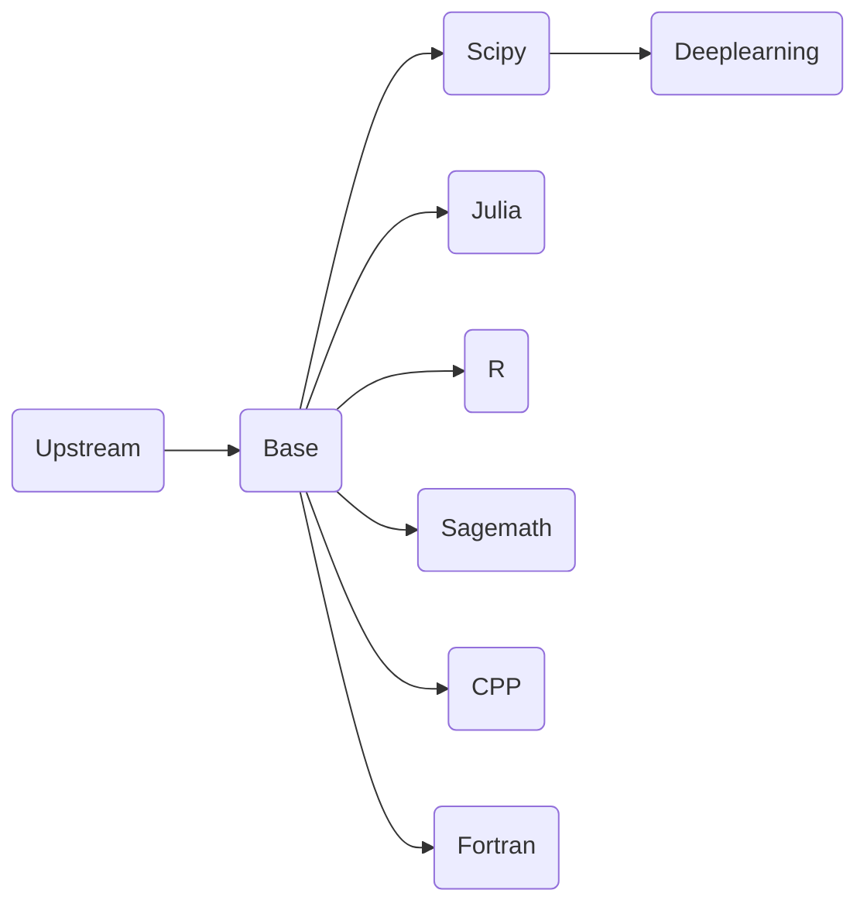

# jupyter-image-stacks

## 如果您通过github访问本项目，请注意
1. github上的仓库是由源仓库推送的镜像仓库，是gitlab的镜像仓库，具体实现可以参考 https://docs.gitlab.com/ee/user/project/repository/mirror/  
2. 我们的源仓库是 https://eoelab.org:1031/build-image-stacks/jupyter-image-stacks  
3. 我们的docker镜像仓库是 https://hub.docker.com/r/ben0i0d/jupyter   
4. 对于issue/PR，我们推荐在源仓库上提，这对于我们工作更方便，但是如果您在github上提，我们也会跟进处理  
## 我是谁
用于支撑eoelab基础计算设施jupyterhub的镜像制作项目  
使用docker作为运行时平台，镜像可以像jupyternotebook一样使用，容器端口为8888  
更多的构建细节可以查看jupyter团队项目https://github.com/jupyter/docker-stacks  
## 镜像依赖关系
节点内为镜像，默认子节点是父节点的派生  

## 参数说明，包括源和版本等
Python 3.8  
Julia 1.8.5  
Tensorflow 默认情况下受支持的最新版  
pytorch 默认情况下受支持的最新版  
oneflow 默认情况下受支持的最新版  
cuda 11.6.2  
cudnn 8  
conda bfsu：https://mirrors.bfsu.edu.cn/help/anaconda/  
pip bfsu：https://mirrors.bfsu.edu.cn/help/pypi/  
apt ustc：https://mirrors.ustc.edu.cn/help/ubuntu.html  
## 目前支持清单
1. Python  
对Python语言的基础支持  
2. Scipy  
Python的科学计算环境  
3. Julia  
对科学计算语言julia的支持    
4. R  
对科学计算语言R的支持    
5. Fortran  
对科学计算语言Fortran的支持  
6. CPP  
对CPP（11,14,17）的支持，并且镜像包括了传统Linux必须的C、Cpp工具链（build-essential）  
您需要额外注意的是，在Notebook中，您的语法结构需要做一定改动，具体可以参考https://github.com/jupyter-xeus/xeus-cling  
例如helloworld程序代码为：  
    ```
    #include <iostream>

    std::cout << "Hello, world!" << "\n";
    ```
7. DeepLearning（With GPU）  
只提供Python语言支持，集成TensorFlow,Pytorch,Transformer,Oneflow支持  
8. Sagemath  
这是一个遵循GPL的开源数学工具  
## 注意
1. 项目内main分支Dockerfile是经过测试而发布的，并且做了本地化工作，包括为apt，Julia，conda，pip默认配置中国境内镜像源  
2. 如果您有新的测试需求，在拥有权限的情况下请自行构建一个新的分支，注意修改新分支内的CI配置文件，并且在提交合并请求时还原CI配置
3. 本项目默认落地场景是我们的K8S集群（RKE）
4. 如果您有更好的思路，可以在本项目中提出issue，PR  
