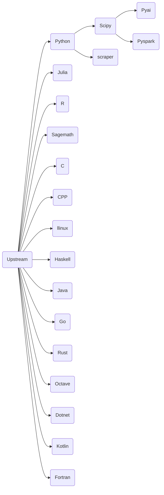

# jupyter-image-stacks
## 如果您通过github访问本项目，请注意
1. github上的仓库是由源仓库推送的镜像仓库，是一个镜像仓库
2. 我们的源仓库是 https://eoelab.org:1031/build-image-stacks/jupyter-image-stacks  
3. 我们的docker镜像仓库是 https://hub.docker.com/r/ben0i0d/jupyter   
4. 对于issue/PR，我们推荐在源仓库上提，这对于我们工作更方便，但是如果您在github上提，我们也会跟进处理  
## 项目梗概
### 用途
用于支撑我们基础计算设施与在线IDE-Jupyterhub的镜像构建项目，测试与工作场景是Rancher管理的基于RKE2的私有K8S集群，并完成汉化，扩展等工作
### 如何使用
#### Docker
镜像可以像jupyternotebook一样使用，容器端口为8888  
对于用后即抛地使用，可以用如下指令,注意这没有数据持久化，意味着你需要使用诸如Git等工具同步您的工作进度  
`docker run -p 8888:8888 ben0i0d/jupyter:<name>`  
对于需要长期使用，可以用如下指令，这将挂载一个目录到容器内,以提供数据持久化  
`docker run -it --rm -p 8888:8888 -v "${PWD}":/home/jovyan ben0i0d/jupyter:<name>`  
#### Jupyterhub
在singleuser内的profile指定镜像即可  
例如：
```
    - description: DL environment with GPU
      display_name: DL_GPU environment
      kubespawner_override:
        extra_resource_limits:
          nvidia.com/gpu: '1'
        image: ben0i0d/jupyter:dl-g
```
### 当前构建镜像清单
* Upstream:镜像上游，类似于jupyter官方的minimal-notebook镜像  
提供软件包：文件压缩/解压(.bz2|.zip|.rar|.7z)，项目管理(git|git lfs),证书管理(ca-certificates)，编辑器（vim）,网络交互（curl|wget） 
* Python：对Python语言的基础支持  
* Scipy：Python的科学计算环境  
* Scraper: Python的网页采取环境
* Pyspark: 提供Python对Apache Spark的支持  
* pyai（With GPU）：提供Python下AI工具链，集成TensorFlow,Pytorch,Transformer,Oneflow支持  
* Llinux：在无特权的情况下学习Linux系统   
提供软件包：build-essential  
* Julia：对科学计算语言julia的支持    
* R：对科学计算语言R的支持    
* Haskell:对Haskell的支持  
* Java:对Java的支持
* Go:对Go的支持
* Kotlin: 对Kotlin的支持
* Rust:对Rust的支持
* C: 对C的支持(C89/ANSI C:all newer versions)，并且镜像包括了传统Linux必须的C、Cpp工具链（build-essential）
* CPP：对CPP（11,14,17）的支持，并且镜像包括了传统Linux必须的C、Cpp工具链（build-essential）  
注意:在Notebook中，您的语法结构需要做一定改动  
例如,Helloworld程序代码为：  
```
    #include <iostream>
    std::cout << "Hello, world!" << "\n";
```
* Fortran：对Fortran的支持
* Sagemath：一个遵循GPL的开源数学工具  
* Dotnet:提供对.net的支持，内置包括（C#,F#,Powershell）  
* Octave: 提供对Octave这一门科学计算语言的支持，兼容matlab，其占用内存小，广受机器学习爱好者的喜爱  
注意:使用到package时，要预先将其加载  
例如：在使用image中函数时，使用以下代码加载image  
`pkg load image`  
package-list:  
```  
Package Name         | Version     |
---------------------+-------------+
            arduino  |       0.8.0 |
              audio  |       2.0.4 | 
                bim  |       1.1.5 | 
         brain2mesh  |       0.7.9 |
              bsltl  |       1.3.1 |
                cgi  |       0.1.2 |
     communications  |       1.2.4 |
            control  |       3.4.0 |
             csxcad  |      0.0.35 |
     data-smoothing  |       1.3.0 |
           database  |       2.4.4 |
          dataframe  |       1.2.0 |
              dicom  |       0.4.0 |
             divand  |       1.1.2 |
            doctest  |       0.7.0 |
       econometrics  |       1.1.2 |
          financial  |       0.5.3 |
               fits  |       1.0.7 |
                fpl  |       1.3.5 |
fuzzy-logic-toolkit  |       0.4.6 |
                 ga  |      0.10.3 |
            general  |       2.1.2 |
           geometry  |       4.0.0 |
                gsl  |       2.1.1 |
              image  |      2.12.0 |
  image-acquisition  |       0.2.2 |
 instrument-control  |       0.7.1 |
           interval  |       3.2.1 |
                 io  |       2.6.4 |
           iso2mesh  |       1.9.6 |
             jnifti  |       0.6.1 |
            jsonlab  |         2.0 |
          level-set  |       0.3.1 |
     linear-algebra  |       2.2.3 |
               lssa  |       0.1.4 |
              ltfat  |       2.3.1 |
            mapping  |       1.4.2 |
            matgeom  |       1.2.3 |
      miscellaneous  |       1.3.0 |
  missing-functions  |       1.0.2 |
                mpi  |       3.1.0 |
                msh  |      1.0.10 |
                mvn  |       1.1.0 |
                nan  |       3.6.1 |
            ncarray  |       1.0.4 |
             netcdf  |      1.0.14 |
              nurbs  |       1.4.3 |
            octclip  |       2.0.1 |
            octproj  |       2.0.1 |
            openems  |      0.0.35 |
             optics  |       0.1.4 |
              optim  |       1.6.1 |
        optiminterp  |       0.3.7 |
           parallel  |       4.0.1 |
             phclab  | 2.4.85+dfsg |
         quaternion  |       2.4.0 |
           queueing  |       1.2.7 |
             secs1d  |       0.0.9 |
             secs2d  |       0.0.8 |
             secs3d  |       0.0.1 |
             signal  |       1.4.1 |
            sockets  |       1.2.1 |
          sparsersb  |       1.0.9 |
            specfun  |       1.1.0 |
            splines  |       1.3.4 |
         statistics  |       1.4.3 |
                stk  |       2.6.1 |
            strings  |       1.2.0 |
             struct  |      1.0.17 |
                tsa  |       4.6.3 |
              vibes  |       0.2.0 |
              video  |       2.0.2 |
               vrml  |      1.0.13 |
             zenity  |       0.5.7 |
             zeromq  |       1.5.3 |
```  
### 镜像依赖关系

### 如何参与
项目内main分支Dockerfile是经过测试而发布的，如果您有测试或者新需求，请构建一个新分支，注意修改新分支内的CI配置文件，并且在提交合并请求时还原CI配置
## 上游
### 软件包上游与版本
Python 3.10  
Julia 1.9.1  
Java zulu17-jdk  
kotlin(jre) openjdk-17-jre
Dotnet 7.0
Tensorflow latest  
pytorch latest  
oneflow latest  
cuda 11.6.2  
cudnn 8  
conda bfsu：https://mirrors.bfsu.edu.cn/help/anaconda/  
pip bfsu：https://mirrors.bfsu.edu.cn/help/pypi/  
apt ustc：https://mirrors.ustc.edu.cn/help/ubuntu.html  
npm npmmirror(AliYun): https://registry.npmmirror.com/  
apache tuna: https://mirrors.tuna.tsinghua.edu.cn/apache/  
julia-pkg ustc: https://mirrors.ustc.edu.cn/julia/  
hackage ustc: https://mirrors.ustc.edu.cn/hackage/  
Stackage ustc: https://mirrors.ustc.edu.cn/stackage/  
GO AliYun: https://mirrors.aliyun.com/goproxy/  
### 项目上游
jupyter团队项目 https://github.com/jupyter/docker-stacks  
**但是我们与上游差别较大，包括源，软件包，本地化与扩展等，因此如果您从本项目派生遇到问题，请不要到jupyter团队提问，这会加大他们的工作量**
### kernel
* C: https://github.com/XaverKlemenschits/jupyter-c-kernel
* Cpp: https://github.com/jupyter-xeus/xeus-cling
* Python：https://ipython.org/
* Go: https://github.com/gopherdata/gophernotes
* Haskell: https://github.com/gibiansky/IHaskell
* Java: https://github.com/SpencerPark/IJava
* Julia: https://github.com/JuliaLang/IJulia.jl
* R: http://irkernel.github.io/
* Rust: https://github.com/evcxr/evcxr
* Octave: https://github.com/Calysto/octave_kernel
* Dotnet(C#,F#,Powershell)： https://github.com/dotnet/interactive
* Kotlin: https://github.com/Kotlin/kotlin-jupyter
* Fortran: https://github.com/lfortran/lfortran
## 必要的版权说明
对于派生自jupyter团队的代码，我们添加了如下的版权声明，我们保留并且支持jupyter开发团队版权
```
# Copyright (c) Jupyter Development Team.
# Distributed under the terms of the Modified BSD License.
```
对于派生自ihaskell-notebook的代码，我们添加了如下的版权声明，我们保留并且支持James Brock <jamesbrock@gmail.com>版权
```
# Copyright (c) James Brock.
# Distributed under the terms of the Modified MIT License.
```
