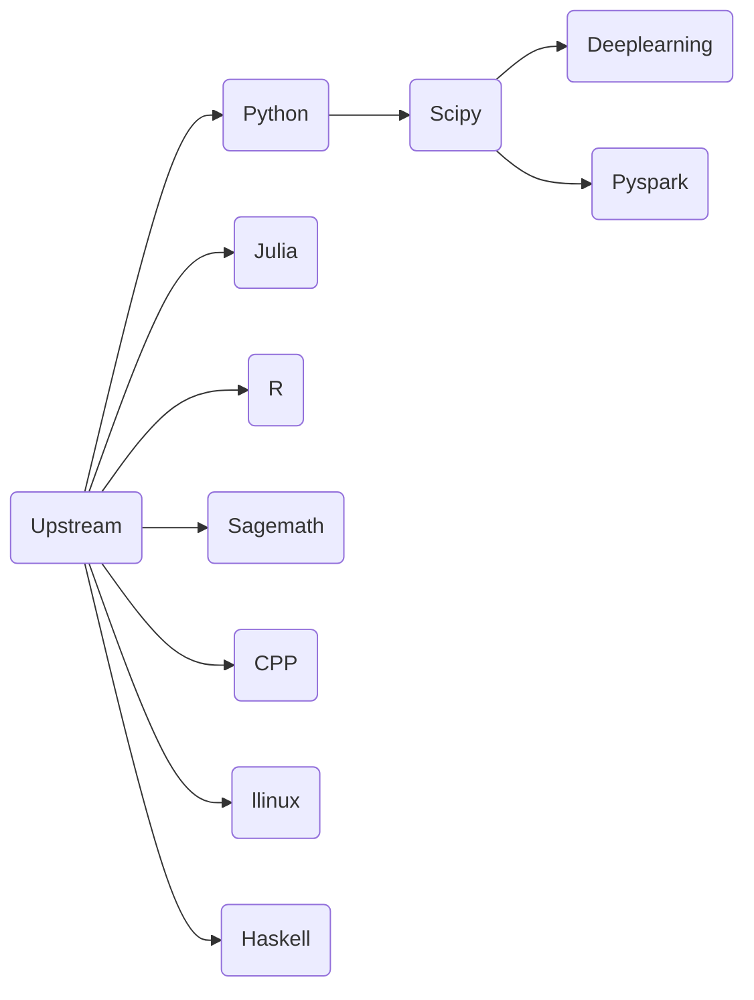

# jupyter-image-stacks
## 如果您通过github访问本项目，请注意
1. github上的仓库是由源仓库推送的镜像仓库，是一个镜像仓库
2. 我们的源仓库是 https://eoelab.org:1031/build-image-stacks/jupyter-image-stacks  
3. 我们的docker镜像仓库是 https://hub.docker.com/r/ben0i0d/jupyter   
4. 对于issue/PR，我们推荐在源仓库上提，这对于我们工作更方便，但是如果您在github上提，我们也会跟进处理  
## 项目梗概
### 用途
用于支撑我们基础计算设施与在线IDE-jupyterhub的镜像构建项目
### 如何使用
#### Docker
镜像可以像jupyternotebook一样使用，容器端口为8888  
对于用后即抛地使用，可以用如下指令,注意这没有数据持久化，意味着你需要使用诸如Git等工具同步您的工作进度  
`docker run -p 8888:8888 ben0i0d/jupyter:<name>`  
对于需要长期使用，可以用如下指令，这将挂载一个目录到容器内,以提供数据持久化  
`docker run -it --rm -p 8888:8888 -v "${PWD}":/home/jovyan ben0i0d/jupyter:<name>`  
#### Jupyterhub
在singleuser内的profile指定镜像即可  
例如：
```
    - description: DL environment with GPU
      display_name: DL_GPU environment
      kubespawner_override:
        extra_resource_limits:
          nvidia.com/gpu: '1'
        image: ben0i0d/jupyter:dl-g
```
### 如何参与以及贡献指导
1. 项目内main分支Dockerfile是经过测试而发布的
2. 如果您有新的测试需求，在拥有权限的情况下请自行构建一个新的分支，注意修改新分支内的CI配置文件，并且在提交合并请求时还原CI配置
3. 本项目默认落地场景是我们的K8S集群（RKE）
4. 如果您有更好的思路，可以在本项目中提出issue，PR  
5. 对于本地化工作，包括apt，Julia，conda，pip,npm配置中国境内镜像源，汉化等，不建议移除
### 参数说明，包括源和版本等
Python 3.10  
Julia 1.9.0  
Tensorflow 默认情况下受支持的最新版  
pytorch 默认情况下受支持的最新版  
oneflow 默认情况下受支持的最新版  
cuda 11.6.2  
cudnn 8  
conda bfsu：https://mirrors.bfsu.edu.cn/help/anaconda/  
pip bfsu：https://mirrors.bfsu.edu.cn/help/pypi/  
apt ustc：https://mirrors.ustc.edu.cn/help/ubuntu.html  
npm npmmirror(AliYun): https://registry.npmmirror.com/  
apache tuna: https://mirrors.tuna.tsinghua.edu.cn/apache/
julia-pkg ustc: https://mirrors.ustc.edu.cn/julia/
hackage ustc: https://mirrors.ustc.edu.cn/hackage/
Stackage ustc: https://mirrors.ustc.edu.cn/stackage/
### 项目上游
本项目直接上游是jupyter团队项目https://github.com/jupyter/docker-stacks  
但是我们与上游的差别较大，包括源，软件包，本地化与扩展等，因此如果您从本项目派生遇到问题，请不要到jupyter团队提问，这会加大他们的工作量  
对于很多自定义化的镜像，请查看对应kernel，或者在项目内提issue  
### 当前构建镜像清单
* Llinux：在无特权的情况下学习Linux系统   
* Python：对Python语言的基础支持  
* Scipy：Python的科学计算环境  
* Julia：对科学计算语言julia的支持    
* R：对科学计算语言R的支持    
* Haskell:对Haskell的支持  
* CPP：对CPP（11,14,17）的支持，并且镜像包括了传统Linux必须的C、Cpp工具链（build-essential）  
您需要额外注意的是，在Notebook中，您的语法结构需要做一定改动，具体可以参考https://github.com/jupyter-xeus/xeus-cling  
例如,Helloworld程序代码为：  
```
    #include <iostream>
    std::cout << "Hello, world!" << "\n";
```
* Pyspark: 提供Python对Apache Spark的支持  
* DeepLearning（With GPU）：只提供Python语言支持，集成TensorFlow,Pytorch,Transformer,Oneflow支持  
* Sagemath：一个遵循GPL的开源数学工具  
## 镜像依赖关系

## 必要的授权说明
对于派生自jupyter团队的代码，我们添加了如下的版权声明，我们保留并且支持jupyter开发团队版权
```
# Copyright (c) Jupyter Development Team.
# Distributed under the terms of the Modified BSD License.
```
对于派生自ihaskell-notebook的代码，我们添加了如下的版权声明，我们保留并且支持James Brock <jamesbrock@gmail.com>版权
```
# Copyright (c) James Brock.
# Distributed under the terms of the Modified MIT License.
```
对于派生自其他kernel的代码，我们还在进一步查阅项目细节
