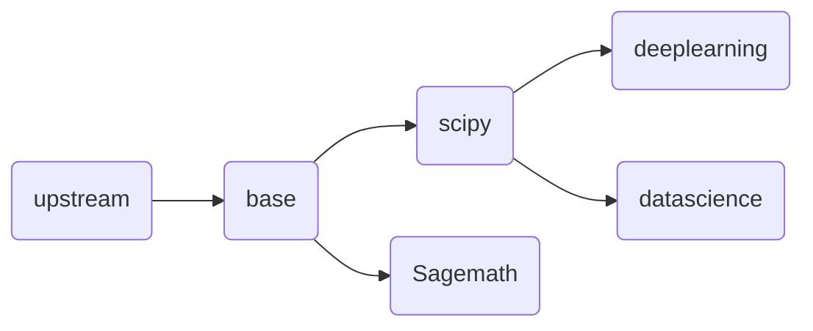

# jupyter-image-stacks

## 如果您通过github访问本项目，请注意
1. github上的仓库是由源仓库推送的镜像仓库，是gitlab的镜像仓库，具体实现可以参考 https://docs.gitlab.com/ee/user/project/repository/mirror/  
2. 我们的源仓库是 https://eoelab.org:1031/build-image-stacks/jupyter-image-stacks  
3. 我们的docker镜像仓库是 https://hub.docker.com/r/ben0i0d/jupyter   
4. 对于issue/PR，我们推荐在源仓库上提，这对于我们工作更方便，但是如果您在github上提，我们也会跟进处理  
## 我是谁
用于支撑eoelab基础计算设施jupyterhub的镜像制作项目  
使用docker作为运行时平台，镜像可以像jupyternotebook一样使用，容器端口为8888  
更多的构建细节可以查看jupyter团队项目https://github.com/jupyter/docker-stacks  
## 镜像依赖关系
节点内为镜像，默认子节点是父节点的派生  

## 目前支持清单
1. Python（CPU）  
这包括Python支持，conda，pip  
2. Scipy（CPU）  
Python的科学计算环境  
3. DataScience（Both CPU And GPU）    
这包括Python与科学计算常用包支持，Julia支持，R与常用包支持    
Julia使用自己的PKG包管理工具，所以使用时注意对PKG换源并且安装包    
4. DeepLearning（Both CPU And GPU）  
通常只提供Python语言支持，集成TensorFlow,Pytorch,Transformer,Oneflow支持  
5. Sagemath（CPU）  
这是一个遵循GPL的开源数学工具  
## 如何提交意见或参与
如果您有更好的思路，可以在本项目中提出issue  
## 注意
1. 项目内main分支Dockerfile是经过测试而发布的
2. 如果您有新的测试需求，在拥有权限的情况下请自行构建一个新的分支，注意修改新分支内的CI配置文件，并且在提交合并请求时还原CI配置
3. 本项目默认落地场景是我们自建的K8S，K8S底层是RKE，也就是docker

