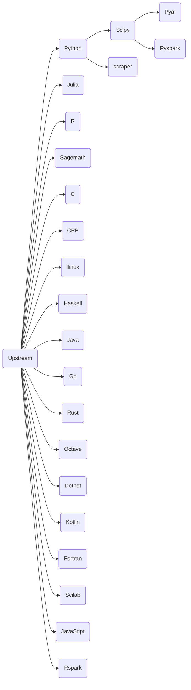

# jupyter-image-stacks
## 如果您通过github访问本项目，请注意
1. github上的仓库是由源仓库推送的镜像仓库，是一个镜像仓库
2. 我们的源仓库是 https://eoelab.org:1031/build-image-stacks/jupyter-image-stacks  
3. 我们的docker镜像仓库是 https://hub.docker.com/r/ben0i0d/jupyter   
4. 对于issue/PR，我们推荐在源仓库上提，这对于我们工作更方便，但是如果您在github上提，我们也会跟进处理  
## 项目梗概
### 用途
用于支撑我们基础计算设施与公开IDE-Jupyterhub的镜像构建项目，测试与工作场景是Rancher管理的基于RKE2的私有K8S集群，并完成汉化，扩展等工作  
### 如何使用

**Docker**

镜像可以像jupyternotebook一样使用，容器端口为8888  
对于用后即抛地使用，可以用如下指令,注意这没有数据持久化，意味着你需要使用诸如Git等工具同步您的工作进度  
`docker run -p 8888:8888 ben0i0d/jupyter:<tag>`  
对于需要长期使用，可以用如下指令，这将挂载一个目录到容器内,以提供数据持久化  
`docker run -it --rm -p 8888:8888 -v "${PWD}":/home/jovyan ben0i0d/jupyter:<tag>`

**Jupyterhub**

在singleuser内的profile指定镜像即可  
例如：
```
    - description: DL environment with GPU
      display_name: DL_GPU environment
      kubespawner_override:
        extra_resource_limits:
          nvidia.com/gpu: '1'
        image: ben0i0d/jupyter:dl-g
```
### 当前构建镜像清单
* Upstream: 镜像上游，类似于jupyter官方的minimal-notebook镜像  
提供软件包：文件压缩/解压(.bz2|.zip|.rar|.7z)，项目管理(git|git lfs),证书管理(ca-certificates)，编辑器（vim）,网络交互（curl|wget）,中文字体（fonts-wqy-zenhei） 
* Llinux（With Desktop-GUI）：在无特权的情况下学习Linux系统，提供Xfce桌面支持   
* Python：对Python语言的基础支持
* C: 对C的支持(versions ≥ C89)，并且镜像包括了传统Linux必须的C、Cpp工具链（build-essential）
* CPP：对CPP（11,14,17）的支持，并且镜像包括了传统Linux必须的C、Cpp工具链（build-essential）  
* Julia：对科学计算语言julia的支持
* R：对科学计算语言R的支持
* Haskell: 对Haskell的支持  
* Java: 对Java的支持
* JavaSript: 对JavaSript的支持
* Go: 对Go的支持
* Kotlin: 对Kotlin的支持
* Rust: 对Rust的支持
* Fortran：对Fortran的支持
* Agda: 对Agda的支持
* Scipy：Python的科学计算环境  
* Scraper: Python的网页采取环境
* Pyspark: 提供Python对Apache Spark的支持  
* pyai（With GPU）：提供Python下AI工具链，集成TensorFlow,Pytorch,Transformer支持  
* Rspark:提供R对Apache Spark的支持
* Sagemath：一个遵循GPL的开源数学工具  
* Dotnet: 提供对.net的支持，内置包括（C#,F#,Powershell）  
* Scilab（With Desktop-GUI）: 提供对Scilab的支持，默认包含apt可获取的全部插件
* Octave: 提供对Octave的支持，兼容matlab，默认包含apt可获取的全部插件  
注意:使用到package时，要预先将其加载,例如在使用image中函数时，使用以下代码加载image,当然octave会提醒缺失  
`pkg load image`  
### 插件清单

**全局**
* jupyterlab-drawio:在Lab中启用drawio绘图工具，drawio是一款非常棒的流程图工具。
* jupyterlab-language-pack-zh-CN:对中文的支持
* jupyterlab_widgets:交互式控件
* jupyterlab-git：图形化操作git仓库
* jupyterlab_latex：支持在线编辑并预览LaTeX文档
* jupyterlab_tabnine：用于自动补全、参数建议、函数文档查询、跳转定义

**局部**
* lckr-jupyterlab-variableinspector:在Lab中展示代码中的变量及其属性，类似RStudio中的变量检查器:R

### 镜像依赖关系


### 如何参与
项目内main分支Dockerfile是经过测试而发布的，如果您有测试或者新需求，请构建一个新分支，注意修改新分支内的CI配置文件，并且在提交合并请求时还原CI配置

## 上游

**软件包版本**
* cuda 12.1.0
* cudnn 8
* Python 3.11
* Julia 1.9.2
* Java zulu17-jdk
* kotlin(jre) openjdk-17-jre
* Dotnet 7.0
* Tensorflow latest
* pytorch latest
* spark 3.4.1

**镜像源**
* conda bfsu：https://mirrors.bfsu.edu.cn/help/anaconda/
* pip bfsu：https://mirrors.bfsu.edu.cn/help/pypi/
* apt ustc：https://mirrors.ustc.edu.cn/help/ubuntu.html
* npm npmmirror(AliYun): https://registry.npmmirror.com/
* apache tuna: https://mirrors.tuna.tsinghua.edu.cn/apache/
* julia-pkg ustc: https://mirrors.ustc.edu.cn/julia/
* hackage ustc: https://mirrors.ustc.edu.cn/hackage/
* Stackage ustc: https://mirrors.ustc.edu.cn/stackage/
* GO AliYun: https://mirrors.aliyun.com/goproxy/
* cargo ustc: git://mirrors.ustc.edu.cn/crates.io-index

### 项目上游
jupyter团队项目 https://github.com/jupyter/docker-stacks

**但是我们与上游差别较大，包括源，软件包，本地化与扩展等，因此如果您从本项目派生遇到问题，请不要到jupyter团队提问，这会加大他们的工作量**

### kernel
* C: https://github.com/XaverKlemenschits/jupyter-c-kernel
* Cpp: https://github.com/jupyter-xeus/xeus-cling
* Python：https://ipython.org/
* Go: https://github.com/gopherdata/gophernotes
* Haskell: https://github.com/gibiansky/IHaskell
* Java: https://github.com/SpencerPark/IJava
* JavaScript: https://github.com/n-riesco/ijavascript
* Julia: https://github.com/JuliaLang/IJulia.jl
* R: http://irkernel.github.io/
* Rust: https://github.com/evcxr/evcxr
* agda: https://github.com/lclem/agda-kernel
* ansible: https://github.com/ansible/ansible-jupyter-kernel
* Octave: https://github.com/Calysto/octave_kernel
* Dotnet(C#,F#,Powershell)： https://github.com/dotnet/interactive
* Kotlin: https://github.com/Kotlin/kotlin-jupyter
* Fortran: https://github.com/lfortran/lfortran

## 必要的版权说明
对于派生自其他团队的代码，我们在文件头添加了原版版权声明，我们保留并且支持其他开发团队版权

