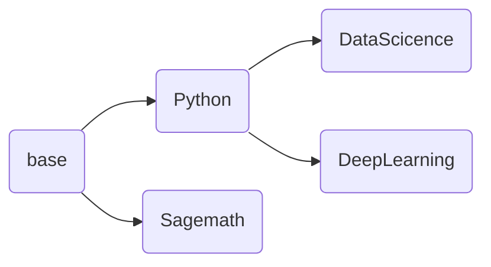

# jupyter-image-stacks

## Who am I?
The image production project supporting jupyterhub,the eoelab basic computing facility.
With docker as the runtime platform, the images can be used like an jupyternotebook with container port 8888.
The construction of more details can be check jupyter team project: https://github.com/jupyter/docker-stacks.
This project plans to switch the headwater of container to Debian, but this is transparent on the client side.
## Mirror dependence
The content of node is an image, and the default child node is a derivative of the parent node.

## Currently supports list
1. Python
This includes Python support, conda, pip.
2. DataScience
This includes Python and Scientific Computing common package support, Julia support, and R with common package support.
Julia uses its own PKG package management tool, so pay attention to change the source of PKG and install the package when using it.
3. Sagemath
This is a GPL-compliant open source math tool.
4. DeepLearning
Usually only provides the Python language support, integrated TensorFlow, Pytorch, Transformer, Oneflow support.
**For DL and DataScience, GPU support, including CUDA, etc**
5. MATLAB
A mathematical tool commonly used in engineering, but requires a user's own license.
**This image may be removed from support in the next version**
## How to submit comments or participate
If you have a better idea, ask the issue in this project.
## Attention
1. By default, all dockerfiles in the main branch of the project are published after testing. The test directory is the image to be tested. Welcome to test.
2. The default application scene of this project is our self-built K8S, and the bottom of K8S is RKE, that is, docker.
